# 🚀 End-to-End DevOps Project: AWS EKS + GitHub Actions + ArgoCD + Terraform

## 📖 Overview

This project demonstrates a complete cloud-native DevOps implementation using Terraform, Amazon EKS, GitHub Actions, Amazon ECR, ArgoCD, Docker, and Kubernetes.

The objective was to automate infrastructure provisioning, container image management, CI/CD pipelines, security scanning, and GitOps-based application deployment for a CodeIgniter E-Commerce application.

---

## 🏗️ Architecture

```text
Developer
    │
    ▼
GitHub Repository
    │
    ▼
GitHub Actions CI Pipeline
    │
    ├── Build Docker Image
    ├── Trivy Security Scan
    └── Push Image to Amazon ECR
    │
    ▼
GitHub Repository Manifest Update
    │
    ▼
ArgoCD GitOps Synchronization
    │
    ▼
Amazon EKS Cluster
    │
    ├── Ecommerce Application
    ├── MySQL Database
    ├── Persistent Volume Claim
    └── Horizontal Pod Autoscaler
```

---

# 🛠️ Tech Stack

## Cloud

* AWS EKS
* AWS ECR
* AWS IAM
* AWS VPC

## Infrastructure as Code

* Terraform

## Containerization

* Docker

## CI/CD

* GitHub Actions
* ArgoCD

## Security

* Trivy

## Orchestration

* Kubernetes

## Application

* PHP
* Apache
* CodeIgniter 4
* MySQL

---

# ✨ Features

* Infrastructure provisioning using Terraform
* Kubernetes deployment on Amazon EKS
* Docker image build and versioning
* GitHub Actions CI/CD pipeline
* Trivy container vulnerability scanning
* Amazon ECR image registry
* GitOps deployment with ArgoCD
* Horizontal Pod Autoscaler
* ConfigMaps and Secrets
* Persistent Storage
* Rolling Updates
* Health Probes
* Automated image tag updates

---

# 📂 Repository Structure

```text
.
├── README.md
├── argocd
│   └── ecommerce-app.yaml
│
├── assets
│   ├── 01-kubernetes-nodes.png
│   ├── 02-kubernetes-pods.png
│   ├── 03-horizontal-pod-autoscaler.png
│   ├── 04-persistent-volume-claim.png
│   ├── 05-argocd-application-status-cli.png
│   ├── 06-argocd-dashboard.png
│   ├── 07-amazon-ecr-images.png
│   ├── 08-amazon-eks-cluster-overview.png
│   ├── 09-amazon-eks-worker-nodes.png
│   ├── 10-github-actions-workflow.png
│   ├── 11-ecommerce-application-homepage.png
│   └── 12-github-actions-security-scan.png
│
├── docs
│   └── images
│
├── ecommerce-ci4
│   ├── app
│   ├── public
│   ├── db_backup
│   │   └── ecommerce.sql
│   ├── Dockerfile
│   └── composer.json
│
├── environments
│   ├── dev
│   └── prod
│
├── kubernetes
│   ├── namespace
│   ├── mysql
│   ├── app
│   ├── jobs
│   ├── ingress
│   └── kustomization.yaml
│
├── modules
│   ├── vpc
│   ├── eks
│   ├── ecr
│   └── s3
│
├── provider.tf
├── terraform.yml.backup
└── terraform-destroy.yml.backup
```
---
## CI/CD Workflow Diagram

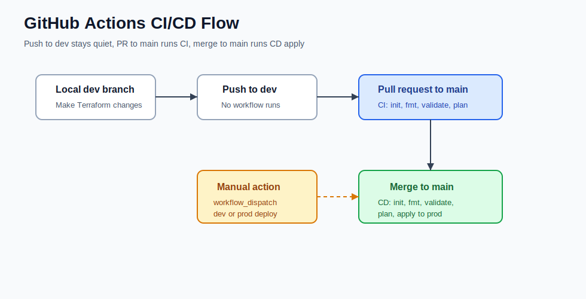
---

# 🚀 Deployment Guide

## Prerequisites

Install:

* AWS CLI
* Terraform
* kubectl
* Docker
* Git

Verify:

```bash
aws --version
terraform version
kubectl version --client
docker --version
```

---

## Clone Repository

```bash
git clone https://github.com/YOUR_USERNAME/terraform-eks-githubactions-argocd.git

cd terraform-eks-githubactions-argocd
```

---

## Configure AWS Credentials

```bash
aws configure
```

Provide:

```text
AWS Access Key
AWS Secret Key
Region: ap-south-1
```

---

## Deploy Infrastructure (Development)

```bash
cd environments/dev

terraform init
terraform plan
terraform apply -auto-approve
```

## Deploy Infrastructure (Production)

```bash
cd environments/prod

terraform init
terraform plan
terraform apply -auto-approve
```
## Architecture Diagram

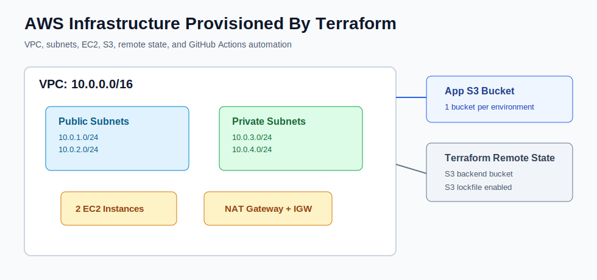

Resources created:

* VPC
* Subnets
* Security Groups
* EKS Cluster
* Worker Nodes
* IAM Roles

---

## Configure kubectl

```bash
aws eks update-kubeconfig \
--region ap-south-1 \
--name ecommerce-eks
```

Verify:

```bash
kubectl get nodes
```

---

## Install ArgoCD

```bash
kubectl create namespace argocd

kubectl apply \
-n argocd \
-f https://raw.githubusercontent.com/argoproj/argo-cd/stable/manifests/install.yaml
```

Verify:

```bash
kubectl get pods -n argocd
```

---

## Create Amazon ECR Repository

```bash
aws ecr create-repository \
--repository-name ecommerce-app
```

---

## Configure GitHub Secrets

Add the following repository secrets:

```text
AWS_REGION
ECR_REPOSITORY
AWS_ROLE_ARN
```

---

## Trigger CI/CD Pipeline

```bash
git push origin main
```

Pipeline stages:

1. Checkout Code
2. Build Docker Image
3. Run Trivy Scan
4. Push Image to Amazon ECR
5. Update Kubernetes Manifest
6. Commit Updated Image Tag
7. ArgoCD Sync

---

## Verify Deployment

```bash
kubectl get nodes

kubectl get pods -A

kubectl get deployment -n ecommerce

kubectl get svc -n ecommerce

kubectl get hpa -n ecommerce

kubectl get pvc -n ecommerce
```

---

## Access Application

```bash
kubectl port-forward \
-n ecommerce \
svc/ecommerce-app \
8080:80
```

Open:

```text
http://localhost:8080
```
# 🗄️ Database Initialization

The application requires a MySQL database.

A database dump is available:

```text
ecommerce-ci4/db_backup/ecommerce.sql
```

Import the schema:

```bash
kubectl apply -f kubernetes/jobs/mysql-import-job.yaml
```

Verify:

```bash
kubectl exec -it -n ecommerce <mysql-pod> -- bash

mysql -u root -proot

SHOW DATABASES;
USE ecommerce;
SHOW TABLES;
```
# ✅ Verification & Operations Commands

## Check EKS Nodes

```bash
kubectl get nodes
```

## Check Application Pods

```bash
kubectl get pods -n ecommerce
```

## Watch Pod Status

```bash
kubectl get pods -n ecommerce -w
```

## Check Deployments

```bash
kubectl get deployment -n ecommerce
```

## Check Services

```bash
kubectl get svc -n ecommerce
```

## Check Persistent Volume Claims

```bash
kubectl get pvc -n ecommerce
```

## Check Horizontal Pod Autoscaler

```bash
kubectl get hpa -n ecommerce
```

## Check ArgoCD Application Status

```bash
kubectl get application -n argocd
```

## Check Application Logs

```bash
kubectl logs -f deployment/ecommerce-app -n ecommerce
```

## Check MySQL Logs

```bash
kubectl logs -f deployment/mysql -n ecommerce
```

## Verify Current Image Version

```bash
kubectl get deployment ecommerce-app \
-n ecommerce \
-o=jsonpath='{.spec.template.spec.containers[0].image}'
```

## Check Images in Amazon ECR

```bash
aws ecr describe-images \
--repository-name ecommerce-app \
--region ap-south-1
```

## Check Rollout Status

```bash
kubectl rollout status deployment/ecommerce-app -n ecommerce
```

## Access Application Locally

```bash
kubectl port-forward \
svc/ecommerce-app \
8080:80 \
-n ecommerce
```

Application URL:

```text
http://localhost:8080
```
---
# 📸 Project Screenshots

## 1. Amazon EKS Cluster Overview

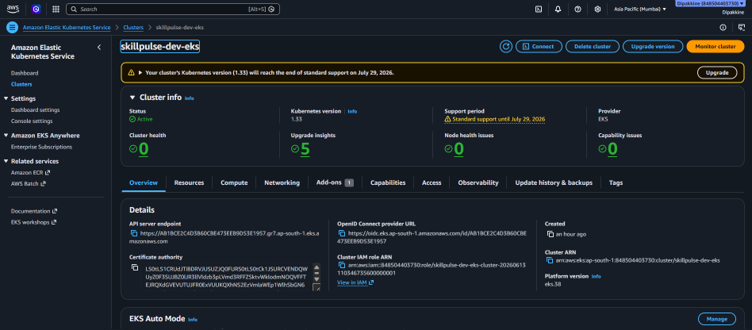

---

## 2. Amazon EKS Worker Nodes

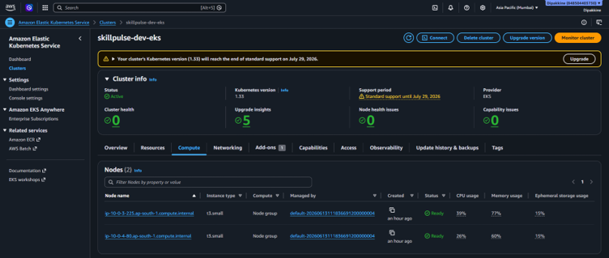

---

## 3. Kubernetes Nodes

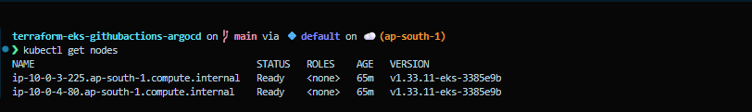

---

## 4. GitHub Actions Workflow

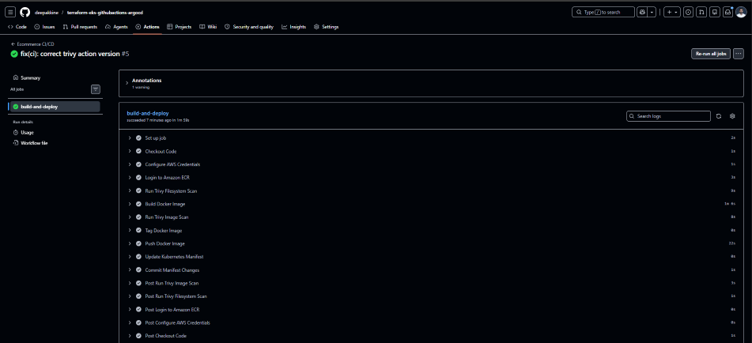

---

## 5. Trivy Security Scan

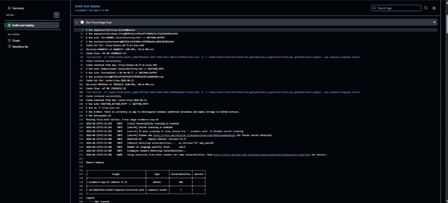

---

## 6. Amazon ECR Images

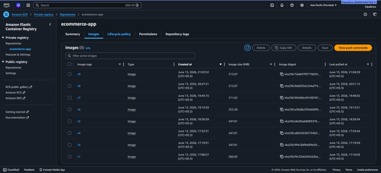

---

## 7. ArgoCD Application Status (CLI)

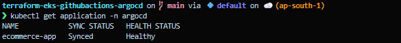

---

## 8. ArgoCD Dashboard

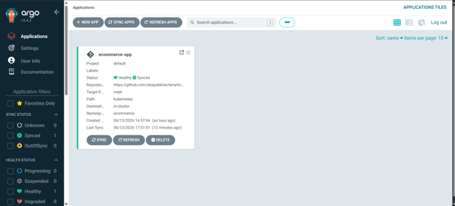

---

## 9. Kubernetes Pods

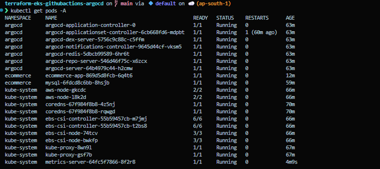

---

## 10. Persistent Volume Claim

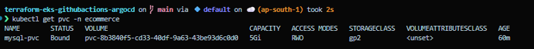

---

## 11. Horizontal Pod Autoscaler

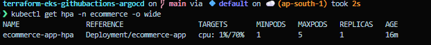

---

## 12. E-Commerce Application Homepage

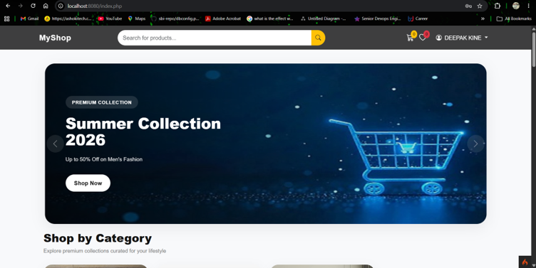
---

# 🔧 Troubleshooting & Challenges Faced

## Issue 1 – CrashLoopBackOff

### Problem

Application pods repeatedly restarted.

### Root Cause

Apache DocumentRoot was incorrectly configured.

### Fix

Changed:

```text
/var/www/html
```

to:

```text
/var/www/html/public
```

---

## Issue 2 – Missing CodeIgniter Dependencies

### Problem

Application returned:

```text
vendor/autoload.php not found
```

### Fix

Implemented multi-stage Docker build and ensured Composer dependencies were copied into the runtime image.

---

## Issue 3 – Missing PHP Extensions

### Error

```text
codeigniter4/framework requires ext-intl
```

### Fix

Installed:

```bash
docker-php-ext-install intl
```

---

## Issue 4 – MySQL Driver Missing

### Fix

Added:

```bash
docker-php-ext-install mysqli pdo pdo_mysql
```

---

## Issue 5 – Database Configuration Error

### Error

```text
Constant expression contains invalid operations
```

### Root Cause

Environment variables were loaded incorrectly inside property declarations.

### Fix

Moved environment variable assignment into the constructor.

---

## Issue 6 – Git Push Rejected

### Error

```text
non-fast-forward
```

### Fix

```bash
git pull --rebase origin main

git push origin main
```

---

## Issue 7 – ArgoCD Synced but Application Not Updated

### Fix

Verified:

```bash
kubectl get deployment -n ecommerce

kubectl get application -n argocd
```

Confirmed image tag updates and rollout status.

---

# ⚠ Known Limitations

- Application currently uses NodePort-based access.
- HTTPS and AWS Application Load Balancer integration are not configured.
- Monitoring stack (Prometheus/Grafana) is not deployed.
- Centralized logging is not configured.
- AWS Secrets Manager integration is not implemented.
- Backup and disaster recovery automation is not implemented.
- This project is intended as a learning and portfolio implementation and is not production hardened.
---
# 🏆 Project Achievements

✔ Provisioned AWS infrastructure using Terraform modules

✔ Created Amazon EKS cluster with managed worker nodes

✔ Configured Amazon ECR as a private container registry

✔ Containerized a CodeIgniter 4 eCommerce application using Docker

✔ Implemented GitHub Actions CI/CD pipeline

✔ Integrated Trivy vulnerability scanning into CI pipeline

✔ Implemented GitOps deployment strategy using ArgoCD

✔ Configured Kubernetes ConfigMaps, Secrets and Persistent Volumes

✔ Implemented Horizontal Pod Autoscaler (HPA)

✔ Automated image tag updates and deployments

✔ Performed end-to-end troubleshooting of Docker, Kubernetes, ArgoCD and application issues

✔ Successfully deployed and validated the application on Amazon EKS
---

# 📚 Key Learnings

* Terraform Infrastructure as Code
* Kubernetes Deployments and Services
* Amazon EKS Administration
* GitHub Actions CI/CD
* GitOps with ArgoCD
* Container Security using Trivy
* Docker Image Optimization
* Production Troubleshooting
* Kubernetes Debugging
* Cloud-Native Application Deployment

---
# 🎯 Interview Questions Covered

### Terraform

- Terraform Modules vs Workspaces
- Terraform State Management
- Remote State Backend
- Module Reusability

### Docker

- Multi-Stage Builds
- Docker Layer Caching
- CMD vs ENTRYPOINT

### Kubernetes

- Deployment vs StatefulSet
- ConfigMap vs Secret
- PVC vs PV
- Readiness vs Liveness Probe
- HPA vs Cluster Autoscaler

### AWS

- EKS Architecture
- ECR Image Management
- IAM Roles for Service Accounts
- VPC Design

### GitOps

- Why ArgoCD?
- How Auto Sync Works
- GitOps vs Traditional CI/CD

### Security

- Trivy Scanning
- Vulnerability Management
- Least Privilege IAM
---
# 🚀 Future Enhancements

- AWS Application Load Balancer (ALB)
- HTTPS using ACM Certificates
- Prometheus Monitoring
- Grafana Dashboards
- Loki Log Aggregation
- AWS Secrets Manager Integration
- External Secrets Operator
- Cluster Autoscaler
- SonarQube Integration
- Multi-Environment GitOps Promotion
- Blue/Green Deployments
- Canary Deployments
---
# 👨‍💻 Author

## Dipak Kine

DevOps Engineer

### Skills

AWS • Terraform • Docker • Kubernetes • GitHub Actions • ArgoCD • Linux • CI/CD • GitOps

📧 kinedipak97@gmail.com

📱 +91 7219367609

🔗 GitHub: https://github.com/deepakkine